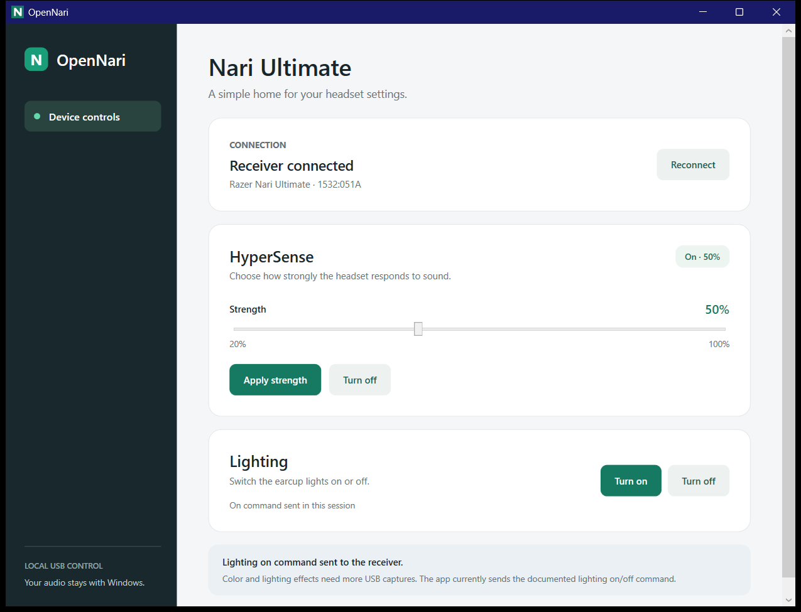

# OpenNari

OpenNari is an open-source Windows app for the Razer Nari Ultimate. It controls HyperSense strength and the earcup lighting switch through the headset's USB receiver. These commands were tested on a connected Nari Ultimate.



## Build

Install the .NET 10 SDK on Windows, then run:

```powershell
dotnet build OpenNari.slnx
dotnet run --project src/OpenNari
```

The app does not replace an audio driver. Sound and microphone continue to use the normal Windows devices.

## Status

This is an early hardware research project. The connected Nari Ultimate has USB IDs `1532:051A` for the receiver and `1532:051B` for the headset when attached by cable. Captures from Synapse show HyperSense strength and static lighting on/off commands. See [protocol notes](docs/protocol.md) for the exact bytes and limits. Color selection and lighting effects still need protocol research.

To inspect the attached HID interfaces, run `dotnet run --project tools/OpenNari.Probe`. The probe also accepts `read`, `haptics on 50`, `haptics off 50`, `light on`, and `light off`. Only the receiver's settings collection receives commands.

## References

- [OpenRGB Nari Ultimate device report and USB capture](https://gitlab.com/CalcProgrammer1/OpenRGB/-/issues/2114)
- [Razer Nari pairing protocol research](https://github.com/juanjodarko/razer-nari-pairing)
- [Earlier Linux Nari driver research](https://github.com/felixZmn/razer-nari-driver)
- [HidSharp](https://github.com/IntergatedCircuits/HidSharp) for Windows HID access

OpenNari is an independent community project and is not affiliated with Razer.
